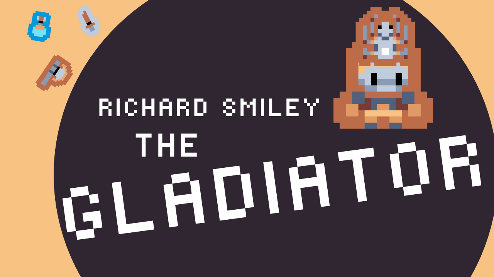
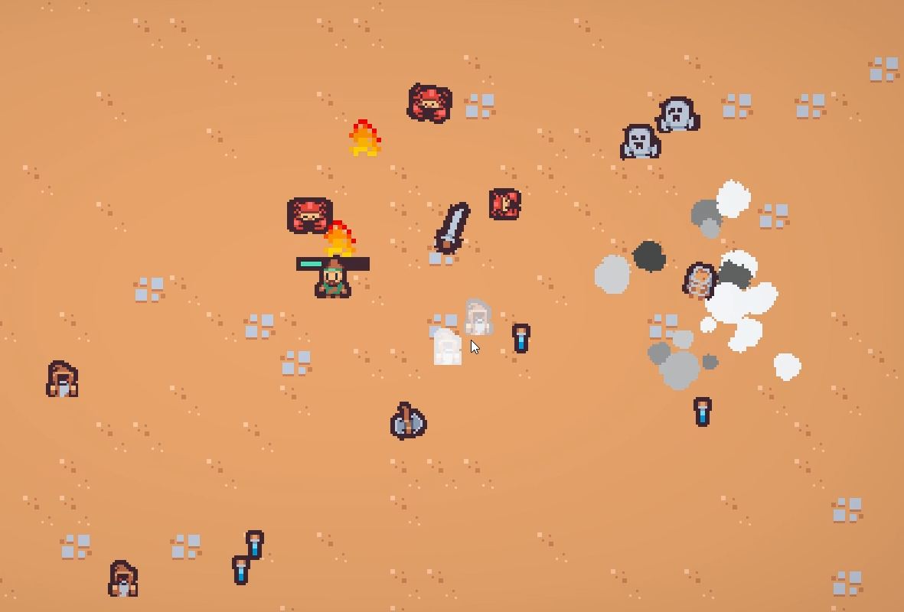
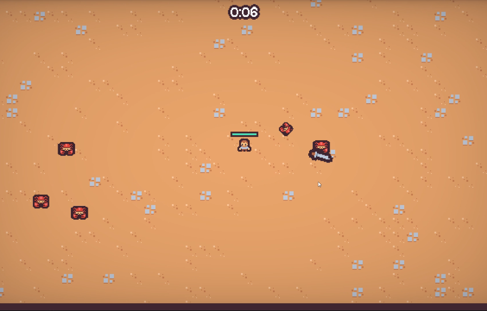
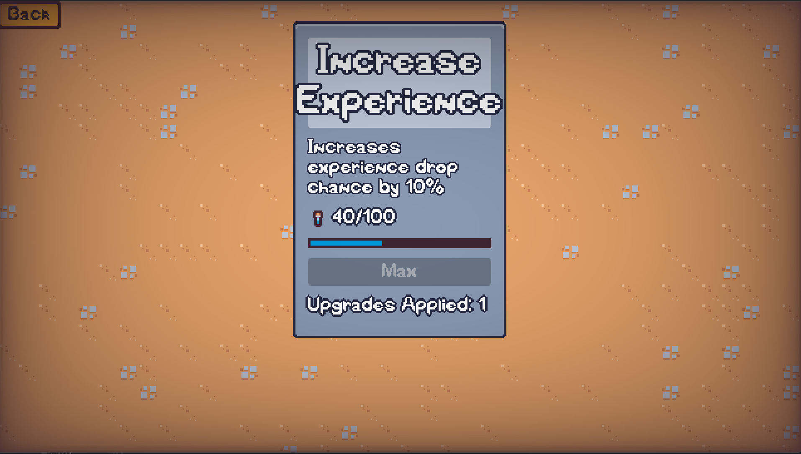
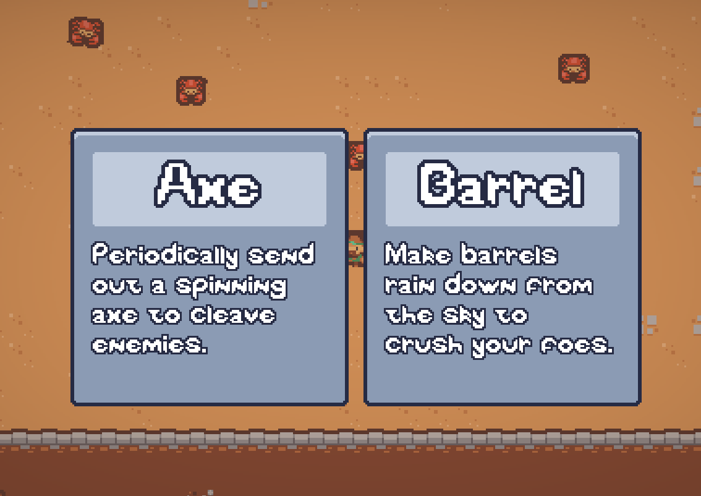

### Richard Smiley the Gladiator is a 2D Survival arena where you must survive ever-increasing waves of enemies while collecting experience to powerup and gain new abilities!

### Play on [Itch.io](https://angelic-garbage.itch.io/richard-smiley-the-gladiator) (play in browser or download for your platform)! **(Browser build may not run on Mobile or Apple Devices)**

## Project Notes

My goal for this project was to create and ship a 'complete' game, and to explore a project structure utilizing customizable components.

## Current Features:

- Character selection on first playthrough
- Volume/sfx/screen mode preferences are adjustable and changes saved
- Difficulty increases as round time progresses
- Melee & Ranged enemies
- Various abilities and upgrades are obtained through gameplay and reset after victory/defeat
- Total experience collected persists between games and can be used to purchase special powerful upgrades that are always applied

## Future Features:

- Add boss enemy
- Add a new arena scene after boss
- Add new enemy types
- Tune difficulty balancing
- Add new upgrades (both meta and normal)
- Add new player abilities (projectile based is #1 priority, see current wizard enemy attack)
- Add floating damage text

## Bugs:

:bug:  
See Issues for currently tracked bugs and create new Issue as needed.

 

