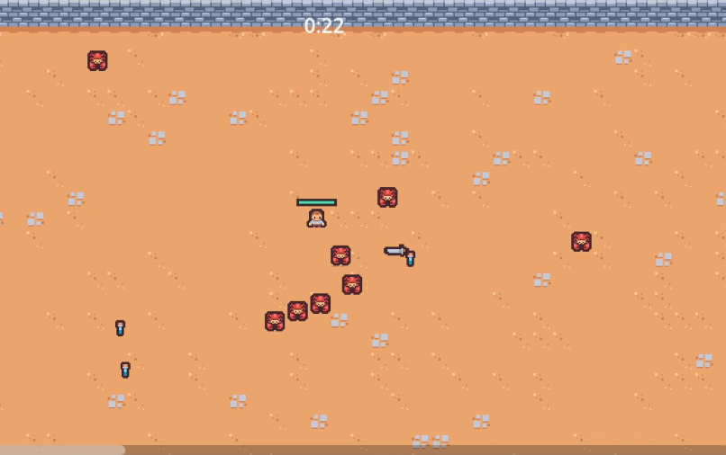

# Swarm

Swarm is a 2D Survival arena where you must survive ever-increasing waves of enemies while collecting experience to powerup and gain new abilities!

### Click [here](https://heidi-negrete.github.io/swarm/) to play

# Project Notes

ECS

# To Dos:

Add VisibilityNotifier to enemy and rework spawn logic to always spawn within arena but outside camera view. (Currently enemies occasionally spawn outside of arena walls)
